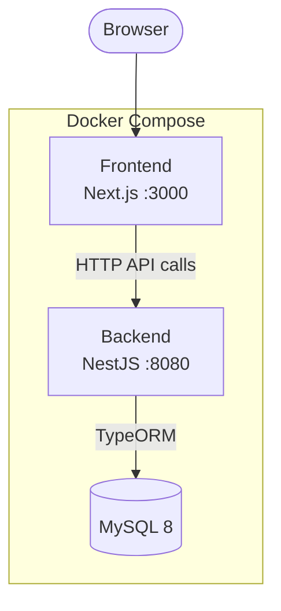

# Enigma

> A structural prototype and reference template demonstrating how to organise a full-stack project with two separate applications — a Next.js frontend and a NestJS backend — in a single repository, orchestrated by Docker Compose.

---

## Purpose

This project is **not a production application**. It exists to showcase:

- A clean folder structure for housing two independent apps in one repository
- A practical tech stack selection for modern full-stack development
- How Docker Compose can wire frontend, backend, and database together as a single unit
- The intended architecture and design approach for a future project built on this foundation

Think of it as a **starting point and design blueprint** — the scaffolding is intentional.

---

## Architecture



---

## Tech Stack

| Layer | Technology |
|-------|-----------|
| **Frontend** | [Next.js 15](https://nextjs.org/) (App Router) |
| | React 19 |
| | TypeScript |
| | Tailwind CSS v4 |
| **Backend** | [NestJS 11](https://nestjs.com/) |
| | TypeScript |
| | TypeORM |
| | MySQL 2 |
| | Passport + JWT (planned auth layer) |
| | bcrypt |
| **Database** | MySQL 8 |
| **Infrastructure** | Docker + Docker Compose |

---

## Project Structure

```
Enigma/
├── docker-compose.yaml        # Orchestrates all three services
├── .gitignore
├── README.md
│
├── frontend/                  # Next.js 15 application
│   ├── src/
│   │   └── app/
│   │       ├── layout.tsx     # Root layout (Geist font, metadata)
│   │       ├── page.tsx       # Home route /
│   │       └── globals.css    # Global Tailwind styles
│   ├── public/
│   ├── Dockerfile
│   ├── next.config.ts
│   ├── tailwind.config.ts
│   ├── tsconfig.json
│   └── package.json
│
└── backend/                   # NestJS 11 application
    ├── src/
    │   ├── main.ts            # Bootstrap — listens on port 8080
    │   ├── app.module.ts      # Root module
    │   ├── app.controller.ts  # HTTP route handlers (stubbed)
    │   ├── app.service.ts     # Service layer
    │   └── user/
    │       └── user.entity.ts # User TypeORM entity (id, name, email, password)
    ├── test/
    ├── Dockerfile
    ├── nest-cli.json
    ├── tsconfig.json
    └── package.json
```

---

## Getting Started

### Prerequisites

- [Docker Desktop](https://www.docker.com/products/docker-desktop/) installed and running
- A `.env` file at the project root with database credentials:

```env
DB_ROOT_PASSWORD=your_root_password
DB_DATABASE=enigma
DB_USER=enigma_user
DB_PASSWORD=your_password
```

### Run with Docker Compose

```bash
docker compose up --build
```

| Service | URL |
|---------|-----|
| Frontend | http://localhost:3000 |
| Backend | http://localhost:8080 |
| Database | localhost:3306 |

### Run individually (development)

**Frontend**

```bash
cd frontend
npm install
npm run dev
```

**Backend**

```bash
cd backend
npm install
npm run start:dev
```

---

## Status

This is a **scaffold / prototype**. The following are declared but intentionally not fully implemented:

- TypeORM database connection (`AppModule` imports are empty)
- Auth endpoints (`/login`, `/register`, `/forgotPassword`, `/resetPassword`) are stubbed
- No frontend-to-backend API integration yet

These serve as a clear marker of where real implementation would begin in a project derived from this template.

---

## Design Goals (for a project built on top of this)

- Separation of concerns between UI and API layers
- Independent deployability of frontend and backend
- A clear database boundary managed by TypeORM entities and migrations
- Stateless JWT-based authentication on the backend
- Containerised from day one for consistency across environments
